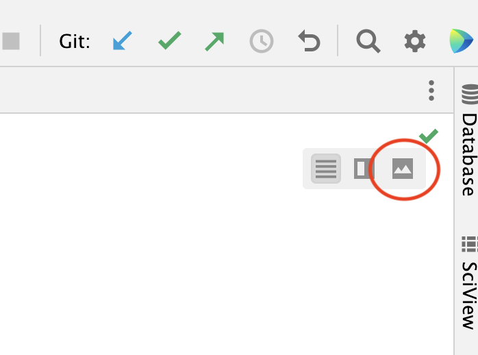
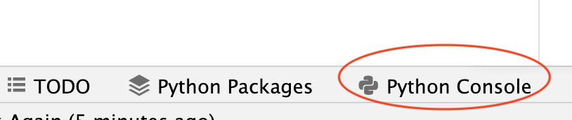
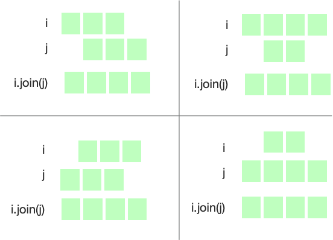

# Intervals HOWTO

This little project is designed to be led by a graduate teaching
assistant (referred to as *TA* below).  If you are not enrolled in a 
formal 
computer science
course, you may attempt it by yourself.  There is an optional part 
at the end that you can finish on your own after your lab. 
You should turn in whatever you have completed at the end of your
scheduled lab, whether it is complete or not.  You will get full credit
for participating in lab, whether or not you reach the end. 

This document is written in a notation called "markdown", which can be
read directly or formatted for easier reading.  If you are using the
PyCharm interactive development environment (IDE), I suggest choosing
the "preview" mode to read it in a nicely formatted version. 



## Introduction:  Review

You already know that Python values can have different types. 
The integer `1` is not the same as the string `"1"`.  An operation
like `+` can mean different things depending on the type of data
it is given to operate on.

Open a Python console window. In PyCharm, you can see this option near
the bottom of your screen: 



In the Python console, try the following three expressions: 

`1 + 1`

`"1" + "1"`

`"1" + 1`

The first expression, adding an int to an int, should give you
an integer result.  The second, adding a string to a string, 
should give you a string result.  The third, attempting to add
a string and an integer, should give you an error.  

In Python, types of data are represented by *classes*.  We are not
limited to the built-in classes like `str` and `int`.  We can 
compose new ones and use them just like the built-in classes. 

## Adding a new type for "number interval"

We can compose a new type of data:  An interval of integers.
We can think of it as a set of integers, but we will represent
it just by its smallest and largest element.  In mathematical 
terms, this will be a "closed interval", because we will consider
both the smallest and largest elements to be members of the 
set of integers, e.g., an interval `3..5` will represent the 
integers 3, 4, and 5.  (Contrast this to the built-in Python 
type `range`, which is "open" at the top, e.g., `range(3,5)` 
includes the integer 3 but does not include the integer 5.) 

Create a Python source file for your new class.  Call it
`interval.py`.  (TA will demonstrate.)

Start your Python source file with a header comment, like this, but
replace the name and data appropriately: 

```python
"""Closed intervals of integers
Stew Dent, 2022-03-32, CIS 211
"""
```

Inside `intervals.py`, declare a new `class` to represent intervals. 

```python
class Interval:
    """An interval m..n represents the set of intervals at least m and at most n."""
```

## Testing it

We don't write a whole program and *then* test it.  We start testing
early and keep at it, checking progress at every step.  If we already
have a test suite, we expect most test cases to fail at first, and
we can gauge progress as we pass more of the test cases.  Often we 
will add new test cases as we add features to a program or module. 
For `intervals.py` we have a test suite, `test_intervals.py`.  

_TA demonstrates how to execute `test_intervals.py` in PyCharm_

Initially we haven't described how to create a new `Interval` object,
so our very first test case should fail.  We'll see an error message
that looks something like this: 

```pycon
  File "/Users/michal/Dropbox/22S-211/projects/labs/lab01-intervals/test_intervals.py", line 17, in test_00_can_create
    i = intervals.Interval(3,5)
TypeError: Interval() takes no arguments
...
    self.fail("Unable to create Interval(3,5)")
AssertionError: Unable to create Interval(3,5)
```

### Add a constructor

Next we need to provide a _constructor_ method. 
The name of a _constructor_ method is always `__init__`. 
We want to
create a new `Interval` object with a call to a method 
like `Interval(3,5)`, so we'll make the constructor
look like this: 

```python
    def __init__(self, low: int, high: int):
        """Interval(low,high) is the interval low..high"""
        self.low = low
        self.high = high
```

What if the low value is greater than the high value?  We should 
disallow this.   If we run the test suite now, we'll get a failure: 

```pycon
FAIL: test_01_oriented (__main__.Test_01_Intervals)
The low end of interval must not exceed the high end (test in constructor)
```

Add code to your constructor method to raise an exception
if `low` is greater than `high`.   You can do this 
by raising `ValueError` in an `if` statement.  Another approach
is to use an `assert` statement.  Execute the test suite again to
make sure this test now passes. 

### A membership method

We'd like to be able to test whether a given integer `i` is 
contained in an interval.  For example, if we set 
`i = intervals.Interval(-1,1)`, we expect 
`i.contains(0)` to return `True` and `i.contains(5)` 
to return `False`. 

The header of this method will look like this: 

```python
    def contains(self, i: int) -> bool:
        """Integer i is within the closed interval"""
```

Discuss with a classmate ways you could write the body of this method.
Which ways do you think are better?  Why? 

Discuss these alternatives with the class, then implement the 
method (i.e., write the body code).  
Run the test suite again to verify that you have correctly
implemented it. 

### Overlapping intervals? 

Maybe we want to know that `Interval(1,3)` overlaps (shares some
elements with) `Interval(2,5)`, but `Interval(1,3)` does not 
overlap `Interval(4,5)` or `Interval(-2,0)`.  Write another 
boolean method with this header: 

```python
    def overlaps(self, other: "Interval") -> bool: 
        """i.overlaps(j) iff i and j have some elements in common"""
```
Discuss in a small group, then in the whole lab, different ways
you might implement this method.  Can you find a simple and clear
way to write it?  (This is harder than the membership test above.)

After choosing an approach, write the method body and test your
implementation again. 

### Let's make some magic

If we want to test methods that create or modify intervals, we will
need a way to check the results, preferably by checking them for 
equality.  But if we try this in the Python console: 

```pycon
x = intervals.Interval(3,5)
y = intervals.Interval(3,5)
x == y
```

we will be disappointed: 

```pycon
False
```

We could write a method `same(self, other: "Interval") -> bool` and
call it like `x.same(y)`, but it would be nicer if we could just tell
Python that when we write `x == y`, we want it to call the method
for us.  We can do that by using a special "magic" name for the 
method, `__eq__`.   When you write `x == y`, Python interprets it
as a method call `x.__eq__(y)`.  Magic! 

```python
    def __eq__(self, other: "Interval") -> bool:
        """Intervals are equal if they have the same low and high bounds"""
```

Can you write this as a simple, readable, one-liner?  You don't need
an `if` statement!  Discuss it with a labmate, then write and 
test your equality checking method.   

### Joining intervals

If two intervals overlap, we may want to combine them into a single
interval.  For example, joining `Interval(3,5)` with `Interval(4,8)`
should give us a new `Interval` object, `Interval(3,8)`.  On the
other hand, attempting to join `Interval(3,5)` with `Interval(7,9)`
should raise an exception.  

```python
    def join(self, other: "Interval") -> "Interval":
        """Create a new Interval that contains the union of elements in self and other.
        Precondition: self and other must overlap.
        """
```

The precondition implies that we should raise an exception if it is 
not true.  We can do that simply with an assertion: 

```python
        assert(self.overlaps(other))
```

How can we implement the rest of this method?  It must work for
all of these cases: 



We do *not* want to write separate code for each of these different
ways two intervals can overlap.  There is a way to do it simply –
in a single line of code – using `min` and `max`.  Discuss
and then implement this approach.  Then test your program once again. 
At this point you should pass all the tests in `test_intervals.py`. 

## Turn it in! 

Before you leave lab, turn your code in with Canvas.  You will
get credit for participating in lab even if you were not able to 
complete the whole exercise. 

### Prettier intervals

If you have more time and want to learn more magic methods, 
I suggesting writing a `__str__` method and a `__repr__` 
method for class `Interval`.  

A `__str__` method should return
a string that communicates well with an end user. 
It is called by the `print` method. 
Without it, 
when we write `print(intervals.Interval(3,5))`, we get output
that looks like `<intervals.Interval object at 0x106981cc0>`.  
We would rather it look like `[3..5]`. 

A `__repr__` method should return something that helps the developer
(that's you) understand a value, especially when debugging.  The 
`__repr__` method provides the string we see when we evaluate an
expression in the Python console. 
Typically
we make it look like a call to the constructor. 

After you define suitable `__str__` and `__repr__` methods,
you should be able to use them in the Python console like this: 

```pycon
>>> i = intervals.Interval(3,5)
>>> i
Interval(3, 5)
>>> print(i)
[3..5]
```
